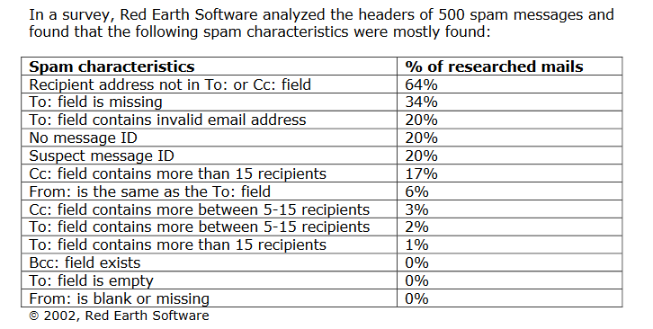

## 垃圾邮件数据集

本节主要涉及到，获取邮件数据集以及选取有效的邮件分类特征。

### 邮件数据集

* 来源：http://www.csmining.org/index.php/spam-email-datasets-.html

  

* 概述

  含标签邮件共计 4327 份，其中 2949 份邮件是正常邮件，另外 1378 份邮件是垃圾邮件（英文邮件）

### 邮件特征选取

文档 http://www.spamhelp.org/articles/Spam-filter-article.pdf 对垃圾邮件头部以及内容特征作了较为详细的分析，下面是该文档对若干头部有效性的分析



#### 邮件头部的特征

结合参考文档的介绍，拟评估以下头部特征对训练数据的有效性

- 字段 `To:` 和 `Cc:` 中的收件地址数量比较多
- 收件地址不在 `To:` 和 `Cc:` 字段，而是将收件地址隐藏在字段 `Bcc:` 和 `X-receiver:` 中，这样做是为了掩盖邮件进行大量发送的事实。从另一角度来看，存在字段 `Bcc:` 则是垃圾邮件可能性极大
- 字段 `To:` 出现以下异常情况：该字段不存在；字段值为空；字段的邮件地址无效；
- 字段 `From:` 出现以下异常情况：该字段不存在；该字段值跟 `To:` 字段相同
- 字段 `Message-Id` 不存在，因为该字段格式为 `xxx@domain.com` ，其中 `domain.com` 暴露了邮件来源
- 字段 `X-mailer` 用来标明邮件发送软件名字，如果是常用发送垃圾邮件软件名 `Floodgate`, `Extractor`, `Masse-mail`, `Fusion`, `NetMailer` 以及 `Quick Shot` 等，则说明邮件是垃圾邮件可能性较大

#### 邮件内容的特征

邮件头部也许对于我们来说不太直观，但邮件内容却是我们几乎每天会看到的。从直觉上来讲，我们会将含有特殊词汇（比如：免费、打折、立即购买等）的邮件视为垃圾邮件，也即邮件中的单词来作为邮件特征。

### 邮件头部特征评估

选取邮件头部 `To`, `From`, `CC`, `Message-Id` 进行评估，各字段测试函数如下：

```
{
	'bcc': lambda item: bool(item),
	'to': lambda item: (not item) or len(item.split('@')) > 10,
	'cc': lambda item: bool(item) and len(item.split('@')) > 10,
	'from': lambda item: not item,
	'message-id': lambda item: not item
}
```

评估结果如下，可以看出特征 `Cc` 和 `bcc` 在垃圾邮件中出现频率极高，可将其作为筛选垃圾邮件特征


### 邮件内容特征评估

拟将单词作为邮件内容的特征，要评估该特征，也即要分析正常邮件和垃圾邮件单词集合的差异，先来对比一下这两类邮件的词云


可以看到垃圾邮件词云具有显著特征，并且如预期的那样，含有较多 money, free, service 等单词，从直觉上来看单词特征可以作为识别垃圾邮件的有效特征，下面再用直方图对这两类邮件中单词进行密度估计，可以看出二者单词分布密度具有较为显著的差异


### 邮件特征小结

通过以上对邮件头部以及内容的特征评估，可见头部的 `Cc` （抄送10份以上）和 `Bcc` （含有该字段）均可以作为特征，另外通过词云以及直方图密度可以看出邮件内容中的单词也可以作为邮件特征。

## 训练邮件分类器

本节主要介绍了，使用朴素贝叶斯模型训练邮件分类器的过程。

### 朴素贝叶斯模型

$$
P(label | w_1,w_2,...,w_k) = \frac {P(w_1,w_2,...,w_k | label)P(label)} {P(w_1,w_2,...,w_k)}
$$

其中 $w_i$ 表示邮件特征事件，本项目拟采用单词是否出现作为邮件特征，并假设各个单词在邮件中出现是没有关联的。值得注意的是，单词在邮件中出现显然是有关联性的，这正是朴素贝叶斯的局限性之一，对各个观察特征之间做了独立假设。

上面等式右边的分母可以看成是归一化常量，因此可以进一步将上述模型简化为如下形式：
$$
Posterior \propto Likelihood * Prior
$$
其中 $Posterior$ 表示当观察到若干单词数据后，得到邮件类型（垃圾邮件或正常邮件）的可能性；$Prior$ 表示邮件类型的先验概率，可以通过该邮件类型在训练数据中的占比来计算；$Likelihood$ 表示观察到单词数据后得到的可能性大小，可以通过训练数据预先计算各个单词对可能性的贡献。

再根据朴素贝叶斯模型假设特征之间独立的特点，可以将模型写为下式：
$$
P(label | w_1,w_2,...,w_k)  \propto {P(w_1 | label)P(w_2|label)...P(w_k|label)P(label)}
$$

### 预测

利用上述模型对邮件预测的本质就是求概率：
$$
P(label=1 | w_1,w_2,...,w_k)  \propto {P(w_1 | label=1)P(w_2|label=1)...P(w_k|label=1)P(label=1)}
$$
以及概率：
$$
P(label=0 | w_1,w_2,...,w_k)  \propto {P(w_1 | label=0)P(w_2|label=0)...P(w_k|label=0)P(label=0)}
$$
然后比较这两个概率的大小，哪个概率大则邮件的 `label` 就是对应的那个。这样就实现了对邮件的预测，下面将主要介绍这两个概率右边的可能性以及先验概率是如何计算的。

### 训练

在该项目中，所谓模型训练，其实就是从训练数据中计算可能性以及先验概率。

先验概率 $P(label=1)$ 和 $P(label=0)$ 可以通过计算训练数据中相应邮件类型的比例来得出，而可能性 $P(w_i|label=1)$ 可以通过计算含有单词 $w_i$ 的正常邮件占正常邮件比例，同理 $P(w_i|label=0)$ 可以通过计算含有单词 $w_i$ 的垃圾邮件占垃圾邮件比例。这些计算都是十分简单的，不过由于邮件文本是一段字符串，在计算概率之前，还需要对原始邮件数据过滤 HTML 标签、大小写一致、分词以及除去停止词等。

### 看不见的单词

设想现在要对一份新邮件进行预测，但是该邮件含有的单词是训练模型时从未出现过的单词，那么该如何处理这类问题呢？

看不见的单词，并不意味着该单词出现的可能性为零，也不意味着训练数据集太小，这是一个常见统计问题。在该项目中对看不见的单词，拟采用基于位置的概率赋值。具体来说，事先预定一个位置因子，比如 `factor=0.7` ，然后对所有看不见单词赋予概率 `sorted(tokens_freq['positive'])[int(len(tokens_freq['positive'])*factor)]` ，也即排序可见单词概率，然后为不可见单词根据位置因子来选取概率。

### 交叉验证

采用5折交叉验证，得到的 precision 和 recall 如下图所示


